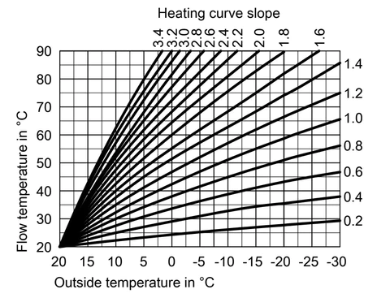

# Frisquet Boiler for ESPHome

This ESPHome component allows communication between an ESPHome device
(ESP8266 or ESP32) and a [Frisquet](<https://www.frisquet.com/en>) heating boiler (equipped with Eco Radio System remote thermostat).

The solution developed is applicable to all Frisquet boilers marketed until 2012 and fitted with the Eco Radio System module. More recent boilers equipped with the Visio module are not compatible because Frisquet has since implemented encryption in its communication protocol.

The **Frisquet Boiler** component appears as a [Float Output](<https://esphome.io/components/output/>) device.

It is recommended to combine it with the **Heating Curve Climate** component also provided in this project. This [Climate](<https://esphome.io/components/climate/index.html>) component will offer temperature control using an outdoor temperature sensor. If needed, it is also possible to use an other type of Climate component, such as the [PID Climate](https://esphome.io/components/climate/pid.html?highlight=pid).

## Breaking change in version 1.5

Some parameters names and behaviour have changed in version 1.5. The parameters `heat_factor` and `offset` of the `heat_curve_climate`component have been replaced by `slope` and `shift`. Those terms are more commonly used by boiler manufacturers.

Whilst `slope` provides the same functionnality as `heat_factor`, `shift` is slightly different. One way to define `shift` is to take the `offset` value you were previously using and substract your usual setpoint temperature (`shift` = `offset` - `setpoint`). Negative values are accepted.

The same changes are applicable to the component [actions](<https://esphome.io/guides/automations.html?highlight=automation#actions>) and component [sensors](<#heat_curve_climate-sensor>).

## References

This work is strongly inspired from:

- <https://antoinegrall.wordpress.com/decodage-frisquet-ers/>
- <http://wiki.kainhofer.com/hardware/vaillantvrt340f>
- <https://github.com/etimou/frisquet-arduino>

and from the discussions made in this thread:

- <https://easydomoticz.com/forum/viewtopic.php?f=17&t=1486sid=d2f41ac68e5bab18fd412a192a21c2c4> (French)

## Wiring

The ESPHome replaces the original Eco Radio System HF receiver and is conneted to the boiler main board through a micro-fit 4 socket.

| ESP32                 | Boiler Side         | Pin number |
| --------------------- | ------------------- |:----------:|
| GND                   | black wire          | 1          |
| Pin 21 (configurable) | yellow wire         | 2          |
| 5V                    | red wire (optional) | 3          |

**Micro-fit 4 pin out:**


Defined viewing direction for the connector pin out:

- Receptable - _rear view_
- Header - _front view_

_Note_: It has been observed that the current supplied by the boiler main board is not sufficent to power the ESP32.

## Installation

The Frisquet ESPHome component concists in two components:

- `heat_curve_climate` a custom [Climate](<https://esphome.io/components/climate/index.html>) component that will control the boiler water setpoint based on external temperature measurement and ambiant temperature setpoint.
- `friquet_boiler` a custom [Float Output](<https://esphome.io/components/output/>) component that will actually communicate with the Frisquet boiler.

They can be installed using the [External Components](https://esphome.io/components/external_components) feature of ESPHome.

### Local

The complete `components` folder must be copied into your `esphome` configuration folder and the YAML configuration file must show the following lines:

```yaml
external_components:
  - source: components
```

### Git

With this method, you don't have to copy the files onto your system. Instead, the configuration file will show the following lines:

```yaml
external_components:
  - source: github://philippemezzadri/frisquet-esphome
```

## Frisquet Boiler Output

The core component allowing communication with the boiler control board is a [Float Output](<https://esphome.io/components/output/>) component:

```yaml
output:
  - platform: frisquet_boiler
    id: boiler_cmd
    pin: 21
    boiler_id: 03B9
```

Configuration variables:

- **id** (**Required**, [ID](<https://esphome.io/guides/configuration-types.html#config-id>)): The id to use for this output component.
- **pin** (**Required**, [Pin](<https://esphome.io/guides/configuration-types.html#config-pin>)): The pin number connected to the boiler.
- **boiler_id** (**Required**, string): The identifier of your boiler (see below).
- All other options from [Float Output](<https://esphome.io/components/output/>).

If `min_power`is set to a value that is not zero, it is important to set `zero_means_zero` to `true`. This can be safely ignored if `min_power` and `max_power` are kept at their default values.

The output value received by the component is any rational value between 0 and 1. Internaly, the output value is multiplied by 100 and rounded to an integer value because the Frisquet Boiler only accepts orders as integers between 0 and 100 :

- 0 : boiler is stopped
- 10 : water pump starts, no heating
- 11 - 100 : water heating
- 15 : for some reason, the value is not accepted by the boiler. Internally, 15 is converted to 16 to avoid this case.

**Important:** the boiler ID that must be indicated in the YAML configuration file is required to allow
your boiler to receive the messages from the ESP. This ID can be retrieved by connecting the radio receiver signal wire to an Arduino.
See [here](https://github.com/etimou/frisquet-arduino) for more details.

## Heating Curve Climate

In addition, a [Climate](<https://esphome.io/components/climate/index.html>) component is necessary to control the output. The [PID Climate](https://esphome.io/components/climate/pid.html?highlight=pid) could be used but it does not provide
smooth control and does not anticipate weather evolution.

It is otherwise recommended to use the **Heating Curve Climate** which adjusts the heating power according to the outdoor temperature.

```yaml
climate:
  - platform: heat_curve_climate
    id: boiler_climate
    name: "Chaudière Frisquet"
    sensor: current_temperature
    outdoor_sensor: outdoor_temperature
    default_target_temperature: 19
    output: boiler_cmd
    visual:
      min_temperature: 7
      max_temperature: 28
      temperature_step: 0.1
    control_parameters:
      slope: 1.45
      shift: 3
      kp: 5
      ki: 0.0001
    output_parameters:
      rounded: true
      minimum_output: 0.1
      output_factor: 1.9
      output_offset: -41
```

Configuration variables:

- **sensor** (**Required**, [ID](<https://esphome.io/guides/configuration-types.html#config-id>)): The sensor that is used to measure the current temperature.
- **outdoor_sensor** (**Required**, [ID](<https://esphome.io/guides/configuration-types.html#config-id>)): The sensor that is used to measure the outside temperature.
- **default_target_temperature** (**Required**, float): The default target temperature (setpoint) for the control algorithm. This can be dynamically set in the frontend later.
- **output** (**Required**, [ID](<https://esphome.io/guides/configuration-types.html#config-id>)): The ID of a float output that increases the current temperature.
- **control_parameters** (_Optional_): Control parameters of the controller (see [below](<#heating-curve-definition>)).
  - **slope** (_Optional_, float): The proportional term (slope) of the heating curve. Defaults to 1.5.
  - **shift** (_Optional_, float): The parallel shift term of the heating curve. Defaults to 0.
  - **kp** (_Optional_, float): The factor for the proportional term of the heating curve. May be useful for accelerating convergence to target temperature. Defaults to 0.
  - **ki** (_Optional_, float): The factor for the integral term of the heating curve. May be useful if target temperature can't be reached. Use with caution when the house has a lot of thermal inertia. Defaults to 0.
- **output_parameters** (_Optional_): Output parameters of the controller (see [below](<#setpoint-calibration-factors>)).
  - **rounded** (_Optional_, boolean): Forces rounding of the output value to two digits. This is recommended if used in conjunction with the `friquet_boiler` output. Defaults to false.
  - **minimum_output** (_Optional_, float): Output value below which output value is set to zero. Defaults to 0.1.
  - **maximum_output** (_Optional_, float): Output value above which output value won't go (cap). Defaults to 1.
  - **heat_required_output** (_Optional_, float): Minimum output value to be considered when the [_Heat Required_ switch](#heat_curve_climate-switch) is on.  Defaults to 0.1.
  - **output_factor** (_Optional_, float): Calibration factor of the output. Defaults to 1.
  - **output_offset** (_Optional_, float): Calibration offset of the output. Defaults to 0.
- All other options from [Climate](<https://esphome.io/components/climate/index.html#config-climate>)

### Heating curve definition

The boiler flow temperature is calculated from the outdoor temperature:

`WATERTEMP` = `slope` \* `DELTA` + `target temperature` + `shift` + `ERROR`* `kp` + `INTEGRAL_TERM`

where :

- `WATERTEMP` is the temperature setpoint for the water circulating in the heating circuit.
- `DELTA` is the temperature difference between the target and the outdoor,
- `ERROR` is the calculated error (target - current)
- `INTEGRAL_TERM` is the cumulative sum of `ki` \* `ERROR` \* `dt`
- `slope`, `shift`, `kp` and `ki` are defined in the Climate `control_parameters`.
- `dt` is the time difference in seconds between two calculations.



In this example, heating curves are given for an ambiant temperature (target) of 20°C with no shift. The `shift`parameter allows you to move up and down the curves by a few degrees.

`slope`and `shift`strongly depend on the heat insulation of the house. Therefore slight adjustments may be necessary to find the best settings. Guidelines to do so can be found [here](https://blog.elyotherm.fr/2013/08/reglage-optimisation-courbe-de-chauffe.html) (French).
In order to ease the fine tuning of those parameters, a service can be set in Home Assistant to change the parameters without restarting ESPHome ([see below](<#integration-with-home-assistant>)).

The following standard values for the `slope` may be used as a guide:

- 0.3 to 0.5 in a well insulated house with underfloor heating
- 1.0 to 1.2 for a well insulated house with radiators
- 1.4 to 1.6 for an older, detached building with radiators

If you don't know how to start, you can use the following values:

```yaml
control_parameters:
  slope: 1.5
  shift: 0
  kp: 2
```

### Setpoint calibration factors

The boiler `SETPOINT` (integer in the `[0 - 100]` range) and the water flow temperature (`WATERTEMP`) are linked by the following formula:

`SETPOINT` = `WATERTEMP` * `output_factor` + `output_offset`

The actual value sent to the Output component is: `RESULT`= `SETPOINT` / 100

`output_factor` and `output_offset` are defined in the Climate `output_parameters`.
The following values seem to work well on **Frisquet Hydromotrix** and **Hydroconfort** boilers:

```yaml
output_parameters:
  rounded: true
  output_factor: 1.9
  output_offset: -41
```

## Temperature Sensors

To get the Climate component working, two temperature sensors are required. They can be retrieved using [`homeassistant`](<https://esphome.io/components/sensor/homeassistant.html>) sensors:

```yaml
sensor:
  - platform: homeassistant
    id: current_temperature
    entity_id: sensor.living_room_temperature
    unit_of_measurement: "°C"
    filters:
      - filter_out: nan
      - heartbeat: 60s
        
  - platform: homeassistant
    id: outdoor_temperature
    entity_id: sensor.outdoor_temperature
    unit_of_measurement: "°C"
    filters:
      - filter_out: nan
      - heartbeat: 60s
```

If you are not using Home Assistant, you can use any local temperature sensor connected to the ESP or retrieve other sensor data using [`mqtt_subscribe`](<https://esphome.io/components/sensor/mqtt_subscribe.html>) sensors.

## `heat_curve_climate` Switch

On some occasions, external temperature conditions or high values of the Proportional and Integral factors may cause the boiler to enter idle mode. This can be undesirable as heat may be required by radiators in other rooms of the house.

To address this issue, the Heating Curve Climate platform provides a switch that will force the boiler to run at a minimum power level instead of shutting off completely.

This ensures that heat is still being supplied to the radiators and helps maintain a comfortable temperature throughout the house.

```yaml
switch:
  - platform: heat_curve_climate
    name: "Heat Required"
```

Configuration variables:

- **name** (**Required**, string): The name of the switch.

When the switch is on, the boiler will run at the minimum power defined by the `heat_required_output` parameter.

## `heat_curve_climate` Sensor

Additionally, the Heating Curve Climate platform provides an optional sensor platform to monitor and give feedback from the Climate component.

```yaml
sensor:
  - platform: heat_curve_climate
    name: "Consigne chaudière"
    type: WATERTEMP
```

Configuration variables:

- **name** (**Required**, string): The name of the sensor.
- **type** (**Required**, string): The value to monitor. One of
  - `RESULT` - The resulting value sent to the output component (float between 0 and 1).
  - `SETPOINT` - The setpoint sent to the boiler (%, actually 100 * `RESULT`).
  - `WATERTEMP` - The resulting water temperature resulting from `SETPOINT`.
  - `DELTA` - The temperature difference between the target and the outdoor.
  - `ERROR` - The calculated error (target - process_variable)
  - `PROPORTIONAL` - The proportional term of the controller (if `kp` is not 0).
  - `INTEGRAL` - The integral term of the controller (if `ki` is not 0).
  - `SLOPE`- The current value of `slope`
  - `SHIFT`- The current value of `shift`
  - `KP`- The current value of `kp`
  - `KI`- The current value of `ki`

Those sensors may be useful to set up your heating curve `control_parameters`.

## `climate.heat_curve.set_control_parameters` Action

This [action](<https://esphome.io/guides/automations.html?highlight=automation#actions>) sets new values for the control parameters. This can be used to manually tune the controller. Make sure to update the values you want on the YAML file! They will reset on the next reboot.

```yaml
on_...:
  then:
    - climate.heat_curve.set_control_parameters:
        id: boiler_climate
        slope: 1.45
        shift: 3
        kp: 0
        ki: 0
```

Configuration variables:

- **id** (**Required**, [ID](<https://esphome.io/guides/configuration-types.html#config-id>)): ID of the Heating Curve Climate.
- **heat_factor** (**Required**, float): The proportional term (slope) of the heating curve.
- **offset** (**Required**, float): The offset term of the heating curve.
- **kp** (_Optional_, float): The factor for the proportional term of the controller. Defaults to 0.
- **ki** (_Optional_, float): The factor for the integral term of the controller. Defaults to 0.

## `climate.pid.reset_integral_term` Action

This [action](<https://esphome.io/guides/automations.html?highlight=automation#actions>) resets the integral term of the PID controller to 0. This might be necessary under certain conditions to avoid the control loop to overshoot (or undershoot) a target.

```yaml
on_...:
  # Basic
  - climate.heat_curve.reset_integral_term: boiler_climate
```

Configuration variables:

- **id** (**Required**, [ID](<https://esphome.io/guides/configuration-types.html#config-id>)): ID of the Heating Curve Climate being reset.

## `boiler.set_mode` Action

This action sets the boiler operating mode.
This parameter is actually included in the frames sent to the boiler but I haven't seen any significant effect of the setting.

```yaml
on_...:
  then:
    - output.set_mode:
        id: boiler_cmd
        mode: 3
```

Configuration variables:

- **id** (**Required**, [ID](<https://esphome.io/guides/configuration-types.html#config-id>)): ID of the Frisquet Boiler Output.
- **mode** (**Required**, int): operating mode (0 = eco / 3 = confort / 4 = away)

## `output.set_level` Action

The `frisquet_boiler` Output component also inherits actions from [Float Output](<https://esphome.io/components/output/>) and in particular [`output.set_level`](<https://esphome.io/components/output/#output-set-level-action>).

This action sets the float output to the given level when executed. This can be usefull to set the boiler output if it is not connected to a Climate component.

```yaml
on_...:
  then:
    - boiler.set_level:
        id: boiler_cmd
        level: 50%
```

Configuration variables:

- **id** (**Required**, [ID](<https://esphome.io/guides/configuration-types.html#config-id>)): ID of the Frisquet Boiler Output.
- **level** (**Required**, percentage): output level

## Integration with Home Assistant

The Heating Curve Climate component automatically appears in Home Assistant as a [Climate](<https://www.home-assistant.io/integrations/climate/>) integration.

Also, when using the [native API](<https://esphome.io/components/api.html>) with Home Assistant, it is also possible to get data from Home Assistant to ESPHome with [user-defined services](<https://esphome.io/components/api.html#api-services>). When you declare services in your ESPHome YAML file, they will automatically show up in Home Assistant and you can call them directly.

This way it is possible to call the [Actions](<https://esphome.io/guides/automations.html?highlight=automation#actions>) provided by the Boiler Output and Heating Curve Climate components:

```yaml
# Example configuration entry
api:
  services:
    - service: set_boiler_setpoint
      variables:
        setpoint: int
      then:
        - output.set_level:
            id: boiler_cmd
            level: !lambda 'return setpoint / 100.0;'

    - service: set_boiler_mode
      variables:
        mode: int
      then:
        - boiler.set_mode:
            id: boiler_cmd
            mode: !lambda 'return mode;'

    - service: set_control_parameters
      variables:
        slope: float
        shift: float
        kp: float
      then:
        - climate.heat_curve.set_control_parameters:
            id: boiler_climate
            slope: !lambda 'return slope;'
            shift: !lambda 'return shift;'
            kp: !lambda 'return kp;'
            ki: !lambda 'return ki;'
        - climate.heat_curve.reset_integral_term: boiler_climate
```

Those lines in the YAML file will expose three [services](https://www.home-assistant.io/docs/scripts/service-calls/) in Home Assistant that can be called with the following lines (provided that the ESP device name is `myFrisquetBoiler`):

### Set climate control parameters

```yaml
service: esphome.myFrisquetBoiler_set_control_parameters
data:
  slope: 1.2
  shift: 3
  kp: 0
```

### Set boiler setpoint Service

```yaml
service: esphome.myFrisquetBoiler_set_boiler_setpoint
data:
  level: 50
```

### Set boiler mode Service

```yaml
service: esphome.myFrisquetBoiler_set_boiler_mode
data:
  mode: 3
```

Those are only examples. Any kind of service can be defined to suit your needs.

## Configuration files

The [boiler.yaml](boiler.yaml) file includes all options described above. To use it, you need to customize all sensors IDs and names. If you are using Dallas temperature sensor, you need to enter their proper addresses. If not, you have to delete the corresponding lines.

The [automations/boiler.yaml](automations/boiler.yaml) file is to be used in Home Assistant. It includes `input_number` and `automation` definitions that allow you to easily manage the `control_parameters` of the ESP. IDs and entity names should be changed before use to suit your own configuration.

The proposed automations allows you to modifiy the `output_parameters` from the Home Assistant UI and to restore them anytime the ESP reboots.

One way of using this file is to copy it in a folder named `packages`of your Home Assistant `config` folder and then add the following in your `configuration.yaml` file:

```yaml
homeassistant:
  packages: !include_dir_named packages
```
