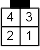

.. _frisquet_boiler:

Frisquet Boiler Output
======================

.. seo::
    :description: Instructions for installing and setting up a Frisquet boiler output.
    :image: logo-friquet.svg

This ``frisquet_boiler`` component allows communication between an ESPHome device and a 
`Frisquet <https://www.frisquet.com/en>`__ heating boiler 
(equipped with Eco Radio System remote thermostat).

The solution developed is applicable to all Frisquet boilers marketed until 2012 and fitted with the 
Eco Radio System module (ERS). More recent boilers equipped with the Visio module are not compatible 
because Frisquet has since implemented encryption in its communication protocol.

.. note:: 
    The communication protocol used by Frisquet is the same as the one used by the Vaillant for its 
    CalorMatic 340f remote controller. This has not been tested but this ESPHome component should 
    work for those products.

Wiring
------

The ESPHome replaces the original Eco Radio System HF receiver and is connected to the boiler main board 
through a micro-fit 4 socket.

.. list-table:: ESP32 to boiler wiring
   :widths: 10 20 10
   :header-rows: 1

   * - ESP32
     - Boiler Side
     - Pin number
   * - GND
     - black wire 
     - 1
   * - GPIO Pin
     - yellow wire
     - 2
   * - 5V
     - red wire (optional)
     - 3

  
    Micro-fit 4 pinout drawing

Defined viewing direction for the connector pin out:
- Receptacle - *rear view*
- Header - *front view*

.. note:: 
  
    It has been observed that the current supplied by the boiler main board is not sufficient to power the ESP32. 
    Therefore, the boiler 5V (red wire) should not be connected to the ESP device.

.. code-block:: yaml

    # Example configuration entry
    output:
      - platform: frisquet_boiler
        id: boiler_cmd
        pin: 21
        boiler_id: 03B9

.. _config-frisquet_boiler:

Configuration variables:
------------------------

- **id** (**Required**, :ref:`config-id`): The id to use for this output component.
- **pin** (**Required**, :ref:`Pin Schema <config-pin_schema>`): The pin number connected to the boiler.
- **boiler_id** (**Required**, string): The identifier of your boiler (see below).
- All other options from :ref:`Output <config-output>`.

If `min_power` is set to a value that is not zero, it is important to set `zero_means_zero` to `true`. 
This can be safely ignored if `min_power` and `max_power` are kept at their default values.

The output value received by the component is any rational value between 0 and 1. 
Internally, the output value is multiplied by 100 and rounded to an integer value because the Frisquet Boiler 
only accepts orders as integers between 0 and 100 :

- 0 : boiler is stopped
- 10 : water pump starts, no heating
- 11 - 100 : water heating
- 15 : for some reason, the value is not accepted by the boiler. Internally, 15 is converted to 16 to avoid this case.

Boiler ID
---------

**Important:** the boiler ID that must be indicated in the configuration variables is required to allow your boiler to receive the messages 
from the ESPome device. This ID can be retrieved by connecting the radio receiver signal wire to an Arduino or an ESP device.
See `here <https://github.com/etimou/frisquet-arduino>`__ for more details.

.. warning::

    This is an **output component** and will not be visible from the frontend. Output components are intermediary
    components that can be attached to for example climate components.

    It is recommended to combine the **Frisquet Boiler Output** with the :doc:`Heating Curve Climate </components/heat_curve_climate>`. 
    This :doc:`/components/climate/index` will offer temperature control using an outdoor temperature sensor. 
    If needed, it is also possible to use any kind of Climate component, such as the :doc:`/components/climate/pid`.

.. note::

    The ``frisquet_boiler`` component will send commands to the boiler right after the update of the ``output`` value and then 
    every 4 minutes. The component must receive regularly updates from the Climate component. 
    To prevent overheating of the boiler, it will stop sending commands to the boiler if the ``output`` value is not updated 
    during 15 minutes. In such case, the boiler will put itself in safe mode.

``frisquet_boiler`` Sensor
-----------------------------

Additionally, the Heating Curve Climate platform provides an optional sensor platform to monitor and give feedback from the Climate component.

.. code-block:: yaml

    sensor:
      - platform: frisquet_boiler
        name: "Boiler flow temperature"
        type: FLOWTEMP

Configuration variables:
************************

- **name** (**Required**, string): The name of the sensor.
- **type** (**Required**, string): The value to monitor. One of
  - ``SETPOINT`` - The setpoint sent to the boiler (%).
  - ``FLOWTEMP`` - The resulting water temperature resulting from ``SETPOINT``.

``boiler.set_mode`` Action
--------------------------

This action sets the boiler operating mode.
This parameter is actually included in the frames sent to the boiler but we haven't seen any significant effect of the setting.

.. code-block:: yaml

   on_...:
     then:
       - output.set_mode:
           id: boiler_cmd
           mode: 3

Configuration variables:
************************

- **id** (**Required**, :ref:`config-id`): ID of the Frisquet Boiler Output.
- **mode** (**Required**, int): operating mode (0 = eco / 3 = confort / 4 = away)

``output.set_level`` Action
---------------------------

The ``frisquet_boiler`` Output component also inherits actions from :ref:`float output <output>` and 
in particular :ref:`output.set_level <output-set_level_action>` action.

This action sets the float output to the given level when executed. This can be usefull to set the boiler output if it is 
not connected to a Climate component.

.. code-block:: yaml

   on_...:
     then:
       - boiler.set_level:
           id: boiler_cmd
           level: 50%

Configuration variables:
************************

- **id** (**Required**, :ref:`config-id`): ID of the Frisquet Boiler Output.
- **level** (**Required**, percentage): output level

See Also
--------

- `Décodage du signal Frisquet Eco Radio System <https://antoinegrall.wordpress.com/decodage-frisquet-ers/>`__ (French)
- `Decoding the wireless heating control Vaillant CalorMatic 340f <http://wiki.kainhofer.com/hardware/vaillantvrt340f>`__
- :doc:`/components/output/index`
- :doc:`/components/climate/index`
- :doc:`/components/climate/heat_curve_climate`
- :apiref:`frisquet_boiler/frisquet_boiler.h`
- :ghedit:`Edit`
