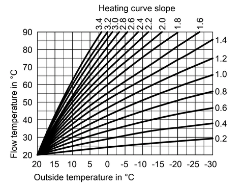
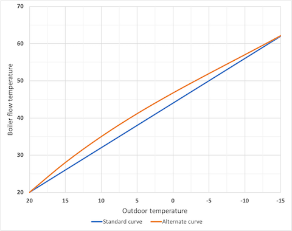

.. _heat_curve_climate:

Heating Curve Climate
=====================

.. seo::
    :description: Instructions for setting up Heating Curve climate controllers with ESPHome.

The ``heating_curve_climate``component provides temperature control based on a heating curve and the outdoor temperature.
It has been developped to be used with the :doc:`/components/output/frisquet_boiler` component but can be used with any kind 
of heating :doc:`/components/output/index`.

.. warning::
    This component works interally as it is connected to a heating boiler and its purpose is to set a water flow temperature 
    throught the generated output value.
    Depending on the Output component you would select, it is important to understand the relationship you need to setup 
    between the internal temperature setpoint that is calculated and the power generated by the heating output.

.. code-block:: yaml

     # Example configuration entry
    climate:
      - platform: heat_curve_climate
        id: boiler_climate
        name: "Chaudière Frisquet"
        sensor: current_temperature
        outdoor_sensor: outdoor_temperature
        default_target_temperature: 19
        output: boiler_cmd
        control_parameters:
          slope: 1.45
          shift: 2
        output_parameters:
          minimum_output: 0.1
          output_factor: 1.9
          output_offset: -41

.. _config-heat_curve_climate:

Configuration variables:
------------------------

- **sensor** (**Required**, :ref:`config-id`): The sensor that is used to measure the current temperature.
- **outdoor_sensor** (**Required**, :ref:`config-id`): The sensor that is used to measure the outside temperature.
- **default_target_temperature** (**Required**, float): The default target temperature (setpoint) for the control algorithm. 
  This can be dynamically set in the frontend later.
- **output** (**Required**, :ref:`config-id`): The ID of a :ref:`float output <config-output>` that increases the current temperature.
- **control_parameters** (*Optional*): Control parameters of the controller.

  - **alt_curve** (*Optional*, boolean): Set to ``true`` to use an alternate heating curve. 
    Defaults to ``false``.  
  - **slope** (*Optional*, float): The proportional term (slope) of the heating curve. 
    Defaults to ``1.5``.
  - **shift** (*Optional*, float): The parallel shift term of the heating curve. 
    Defaults to ``0``.
  - **kp** (*Optional*, float): The factor for the proportional term added tothe heating curve. 
    May be useful for accelerating convergence to target temperature. 
    Defaults to ``0``.
  - **ki** (*Optional*, float): The factor for the integral term added to the heating curve. 
    May be useful if target temperature can't be reached. Use with caution when the house has a lot of thermal inertia. 
    Defaults to ``0``.
  
- **output_parameters** (*Optional*): Output parameters of the controller.

  - **rounded** (*Optional*, boolean): Forces rounding of the output value to two digits.
    Defaults to ``false``.
  - **minimum_output** (*Optional*, float): Output value below which output value is set to zero. 
    Defaults to ``0.1``.
  - **maximum_output** (*Optional*, float): Output value above which output value won't go (cap). 
    Defaults to ``1``.
  - **heat_required_output** (*Optional*, float): Minimum output value to be considered when the *Heat Required* switch is on.
    Defaults to ``0.1``.
  - **output_factor** (*Optional*, float): Calibration factor of the output. 
    Defaults to ``1``.
  - **output_offset** (*Optional*, float): Calibration offset of the output.
    Defaults to ``0``.

- All other options from :ref:`Climate <config-climate>`.

Heating curve definition
------------------------

The boiler flow temperature is calculated from the outdoor temperature:

``WATERTEMP`` = ``slope`` \* ``DELTA`` + ``target temperature`` + ``shift``

where :

- ``WATERTEMP`` is the temperature setpoint for the water circulating in the heating circuit.
- ``DELTA`` is the temperature difference between the target and the outdoor,
- ``slope`` and ``shift`` are defined in the Climate ``control_parameters``.


  
    Example of heating curves with different slopes

In this example, heating curves are given for an ambient temperature (target) of 20°C with no shift. 
The ``shift`` parameter allows you to move up and down the curves by a few degrees.

``slope`` and ``shift`` strongly depend on the heat insulation of the house. Therefore slight adjustments may be necessary to find the best settings. 

The following standard values for the ``slope`` may be used as a guide:

- 0.3 to 0.5 in a well-insulated house with underfloor heating
- 1.0 to 1.2 for a well-insulated house with radiators
- 1.4 to 1.6 for an older, detached building with radiators

If you don't know how to start, you can use the following values:

.. code-block:: yaml

    control_parameters:
      slope: 1.5
      shift: 0
      kp: 2

Alternate heating curve
***********************

If you struggle in finding the good ``slope`` and ``shift``, you can try to set ``alt_curve`` to ``true``. 
You can do it especially if you can't find settings that work for both cold winter and spring. 
The alternate heating curve is not linear like the standard curve but is polynomial and is designed to show 
a reduced slope for high delta between the outdoor and target temperatures.


  
    Comparison of teh standard and alternate hetaing curves

In the above example, both curves have the same ``slope`` parameter.

Proportionnal and integral terms
--------------------------------

If needed, proportionnal and integral terms can be added to the heating curve:

``WATERTEMP`` =  ``HEATING_CURVE_TEMP`` + ``ERROR`` \* ``kp`` + ``INTEGRAL_TERM``

where :

- ``WATERTEMP`` is the temperature setpoint for the water circulating in the heating circuit.
- ``HEATING_CURVE_TEMP``is the heating curve temperature calculate dabove.
- ``ERROR`` is the calculated error (target - current)
- ``INTEGRAL_TERM`` is the cumulative sum of ``ki`` \* ``ERROR`` \* ``dt``
- ``dt`` is the time difference in seconds between two calculations.
- ``kp`` and ``ki`` are defined in the Climate ``control_parameters``.

.. warning::
    Setting a proportionnal factor `kp` can be useful to accelerate the convergence when the target temperature is changed. The value of `kp` should remain low to maintain the stability of the system and avoid overshoots.

    However, setting an integral factor `ki`can be tricky to use and depends on many factors such as the house thermal inertia. We do not recommend to use it unless you know what you are doing.

Temperature calibration factors
-------------------------------

The boiler ``SETPOINT`` (integer in the ``[0 - 100]`` range) and the water flow temperature (``WATERTEMP``) 
are linked by the following formula:

``SETPOINT`` = ``WATERTEMP`` * ``output_factor`` + ``output_offset``

The actual value sent to the Output component is: ``RESULT``= ``SETPOINT`` / 100

``output_factor`` and ``output_offset`` are defined in the Climate ``output_parameters``.
The following values seem to work well on **Frisquet Hydromotrix** and **Hydroconfort** boilers:

.. code-block:: yaml

    output_parameters:
      output_factor: 1.9
      output_offset: -41

Setup
-----

To get the Climate component working, you need a few additional components:

- A :ref:`Sensor <config-sensor>` to read the current temperature (``sensor``).
- A :ref:`Sensor <config-sensor>` to read the outdoor temperature (``outdoor_sensor``).
- A :ref:`float output <config-output>` to drive for heating.
  
  This could for example be a :doc:`/components/output/friquet_boiler` for which this climate component has 
  been developped. Or a PWM output via :doc:`/components/output/sigma_delta_output` or :doc:`/components/output/slow_pwm` 
  that drives a heating unit.

  Please note the output *must* be controllable with continuous value (not only ON/OFF, but any state
  in between for example 50% heating power).

.. note::
    Sensors should have a regular update interval as the heat curve update frequency is tied to the update
    interval of the sensors.
    We recommend putting a filter on the sensors (see filters in :doc:`/components/sensor/index`) to filter out the noise
    to ensure better stability of the output.

``heat_curve_climate`` Switch
-----------------------------

On some occasions, external temperature conditions or high values of the Proportional and Integral factors may cause the boiler to enter idle mode. 
This can be undesirable as heat may be required by radiators in other rooms of the house.

To address this issue, the ``heat_curve_climate`` platform provides a switch that will force the boiler to run at a minimum power level instead of shutting off completely.

This ensures that heat is still being supplied to the radiators and helps maintain a comfortable temperature throughout the house.

.. code-block:: yaml

   switch:
     - platform: heat_curve_climate
       name: "Heat Required"

Configuration variables:
************************

- **name** (**Required**, string): The name of the switch.

When the switch is on, the boiler will run at the minimum power defined by the ``heat_required_output`` parameter.

``heat_curve_climate`` Sensor
-----------------------------

Additionally, the Heating Curve Climate platform provides an optional sensor platform to monitor and give feedback from the Climate component.

.. code-block:: yaml

    sensor:
      - platform: heat_curve_climate
        name: "Consigne chaudière"
        type: WATERTEMP

Configuration variables:
************************

- **name** (**Required**, string): The name of the sensor.
- **type** (**Required**, string): The value to monitor. One of
  - ``RESULT`` - The resulting value sent to the output component (float between ```0`` and ``1``).
  - ``SETPOINT`` - The setpoint sent to the boiler (%, actually 100 * ``RESULT``).
  - ``WATERTEMP`` - The calculated heating water temperature.
  - ``DELTA`` - The temperature difference between the target and the outdoor.
  - ``ERROR`` - The calculated error (target - process_variable)
  - ``PROPORTIONAL`` - The proportional term of the controller (if ``kp`` is not ``0``).
  - ``INTEGRAL`` - The integral term of the controller (if ``ki`` is not ``0``).
  - ``SLOPE``- The current value of ``slope``
  - ``SHIFT``- The current value of ``shift``
  - ``KP``- The current value of ``kp``
  - ``KI``- The current value of ``ki``

Those sensors may be useful to set up your heating curve ``control_parameters``.

``climate.heat_curve.set_control_parameters`` Action
----------------------------------------------------

This action sets new values for the control parameters. 
This can be used to manually tune the controller. Make sure to update the values you want on the YAML file! They will reset on the next reboot.

.. code-block:: yaml

    on_...:
      then:
        - climate.heat_curve.set_control_parameters:
            id: boiler_climate
            slope: 1.45
            shift: 3
            kp: 0
            ki: 0

Configuration variables:
************************

- **id** (**Required**, :ref:`config-id`): ID of the Heating Curve Climate.
- **heat_factor** (**Required**, float): The proportional term (slope) of the heating curve.
- **offset** (**Required**, float): The offset term of the heating curve.
- **kp** (*Optional*, float): The factor for the proportional term of the heating curve. 
  Defaults to ``0``.
- **ki** (*Optional*, float): The factor for the integral term of the heating curve. 
  Defaults to ``0``.

``climate.pid.reset_integral_term`` Action
------------------------------------------

This actiob resets the integral term of the PID controller to 0. This might be necessary under certain 
conditions to avoid the control loop to overshoot (or undershoot) a target.

.. code-block:: yaml

   on_...:
     # Basic
     - climate.heat_curve.reset_integral_term: boiler_climate

Configuration variables:
************************

- **id** (**Required**, :ref:`config-id`): ID of the Heating Curve Climate being reset.

See Also
--------
- :doc:`/components/climate/index`
- :doc:`/components/output/index`
- :doc:`/components/output/frisquet_boiler`
- :apiref:`climate/heat_curve_climate/heat_curve_climate.h`
- :ghedit:`Edit`
